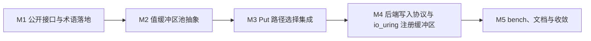

# P8 - 零拷贝写入路径主路径化 · 设计文档索引

状态：🚧 设计中（P8-D1 ~ P8-D11 已讨论锁定；M1 ~ M3 已实装，M4 ~ M5 待详细设计与实现）

## 1. 阶段目标

P8 的目标是把 1 MiB value 的写入路径从“先复制进 Cabe 内部临时缓冲区，再写入设备”的模式，推进为“优先直接使用满足条件的 value 内存写入设备”的模式。

P8 只改变 value 写入路径，不改变 key 的语义。key 仍然用于路由、索引和日志记录；value 继续维持固定 1 MiB 的强约束。

P8 的公开写入接口保持统一：

```cpp
Status Engine::Put(std::string_view key, DataView value);
```

上层应用不需要选择“普通写入接口”或“零拷贝写入接口”。是否走零拷贝路径，由 Cabe 内部根据 value 来源、内存形态、目标设备、后端能力完成判断。

## 2. 总体定位

P8 同时支持两类 value 来源：

| value 来源 | 预期路径 | 说明 |
| --- | --- | --- |
| 应用端自行分配的 value 内存 | 条件式零拷贝 | 满足大小、地址、长度、对齐和后端能力要求时，直接写入；否则复制回退。 |
| Cabe 通过公开分配接口返回的 `ValueBuffer` | 主零拷贝路径 | Cabe 负责分配满足当前后端要求的值缓冲区，应用填充后仍通过统一 `Put` 写入。 |

P8 当前仍基于 `io_uring` 路线实施，但接口和内部抽象必须为未来 SPDK 做准备：

- P8 不引入 SPDK 依赖；
- P8 不实现 SPDK 后端；
- P8 的 `ValueBuffer`、值缓冲区池和内部写入描述符不得绑定到 `io_uring` 专属概念；
- 未来 P10 切换 SPDK 时，`ValueBuffer` 应当能够自然映射到 SPDK 大页内存池。

## 3. 术语边界

| 术语 | 含义 |
| --- | --- |
| 值内存 | `DataView` 指向的上层应用 value 内存。 |
| Cabe 值缓冲区 | 由 Cabe 分配、固定 1 MiB、用于主零拷贝路径的 value 缓冲区对象。 |
| 值缓冲区池 | Cabe 内部管理 Cabe 值缓冲区的抽象层。 |
| 零拷贝写入路径 | value 数据不再复制到 Cabe 内部临时数据块，而是直接作为后端写入输入。 |
| 复制回退路径 | value 内存不满足零拷贝条件时，复制到 Cabe 内部对齐缓冲区后再写入。 |
| 键绑定 | 分配 Cabe 值缓冲区时使用 key 建立绑定关系，并计算目标设备；后续只有同一个 key 调用 `Put` 时，才可以命中 Cabe 值缓冲区的主零拷贝路径。 |

## 4. P8 范围

P8 包含：

- 新增公开 `ValueBuffer` 抽象；
- 新增公开值缓冲区分配接口；
- 新增每设备值缓冲区池容量配置；
- 新增内部值缓冲区池抽象层；
- 在 `reactor` 写入执行层完成零拷贝路径选择；
- 将后端写入协议从裸指针升级为内部写入缓冲区描述符；
- 在 `io_uring` 后端接入注册缓冲区写入能力；
- 保留应用自备内存的复制回退路径；
- 增加单元测试、集成测试和 bench 测试；
- 补齐使用文档、约束文档和 P8 性能档案。

P8 不包含：

- SPDK 后端实现；
- SPDK 大页内存真实接入；
- 跨进程外部内存导入；
- 公开“强制零拷贝”写入接口；
- 公开写入路径统计接口；
- 写入流水线化；
- 多副本写入；
- NUMA 深度优化。

## 5. 已锁定设计决策

| 决策点 | 结论 |
| --- | --- |
| P8-D1 术语边界 | 采用“值内存 / Cabe 值缓冲区 / 值缓冲区池 / 零拷贝写入路径 / 复制回退路径 / 键绑定”。 |
| P8-D2 公开写入接口 | `Put` 语义保持统一，不拆分公开写入接口；路径选择在 Cabe 内部完成，主要落在 `reactor` 写入执行层。 |
| P8-D3 应用端自备值内存 | 应用端自行分配的 value 进入条件式零拷贝；不满足条件时复制回退，不把“不能零拷贝”暴露为写入错误。 |
| P8-D4 Cabe 值缓冲区 | 新增 Cabe 分配的 `ValueBuffer`，作为主零拷贝路径；应用填充后仍调用统一 `Put`。 |
| P8-D5 值缓冲区池抽象 | 新增内部 `ValueBufferPool` 抽象层，负责分配、释放、来源识别、设备归属和后端私有信息。 |
| P8-D6 键绑定与设备归属 | `ValueBuffer` 按 key 分配并绑定该 key；后续 `Put` 只有使用同一个 key 且目标设备匹配时才命中主零拷贝路径，否则复制回退。 |
| P8-D7 后端写入协议 | 内部后端写入协议升级为写入缓冲区描述符，公开 API 不暴露该描述符。 |
| P8-D8 SPDK 预留边界 | P8 不引入 SPDK，但所有公开接口和内部抽象必须保持后端中立。 |
| P8-D9 资源配置与耗尽语义 | 每设备配置值缓冲区池容量；池耗尽返回带 `Status` 的结果，不阻塞等待。 |
| P8-D10 测试可观测性 | 不新增公开路径统计接口；通过值缓冲区池、后端协议和 Engine 行为测试证明路径正确性。 |
| P8-D11 bench 测试口径 | 保留现有 `BM_Put`，新增非对齐自备内存、对齐自备内存、Cabe `ValueBuffer` 三类 Put bench。 |

## 6. 里程碑拆分

P8 拆分为 5 个实施里程碑：



| 里程碑 | 文档 | 状态 | 核心目标 |
| --- | --- | --- | --- |
| P8M1 | `P8M1_value_buffer_api_design.md` | ✅ 已实装 | 固定公开 `ValueBuffer` API、分配结果、配置项和术语文档。 |
| P8M2 | `P8M2_value_buffer_pool_design.md` | ✅ 已实装 | 建立内部值缓冲区池抽象，实现每设备 1 MiB 对齐缓冲区管理。 |
| P8M3 | `P8M3_put_path_design.md` | ✅ 已实装 | 在 `Engine::Put` 到 `Reactor::ExecutePut` 路径中接入零拷贝判断和复制回退。 |
| P8M4 | `P8M4_backend_write_protocol_design.md` | ⏳ 待设计 | 升级后端写入协议，并在 `io_uring` 后端接入注册缓冲区写入。 |
| P8M5 | `P8M5_bench_convergence_design.md` | ⏳ 待设计 | 补齐 bench、文档、回归测试和 P8 性能档案。 |

## 7. P8M1 - 公开接口与术语落地

目标：

- 新增公开 `ValueBuffer` 类型；
- 新增公开值缓冲区分配接口；
- 新增分配结果类型；
- 新增每设备值缓冲区池容量配置；
- 固定 P8 术语和 API 语义。

建议接口形态：

```cpp
class ValueBuffer {
 public:
  ValueBuffer() noexcept;
  ValueBuffer(ValueBuffer&&) noexcept;
  ValueBuffer& operator=(ValueBuffer&&) noexcept;

  ValueBuffer(const ValueBuffer&) = delete;
  ValueBuffer& operator=(const ValueBuffer&) = delete;

  DataBuffer data() noexcept;
  DataView view() const noexcept;
  bool valid() const noexcept;
};

struct ValueBufferResult {
  Status status;
  ValueBuffer buffer;
};

ValueBufferResult Engine::AllocateValueBuffer(std::string_view key);
```

`ValueBuffer` 需要表达：

- 固定 1 MiB；
- 移动语义；
- 自动归还资源；
- 不暴露后端私有信息；
- 可被 `Put` 通过 `DataView` 使用；
- 生命周期必须覆盖 `Put` 调用过程。

P8M1 退出条件：

- 公开 API 设计定稿；
- 配置项语义定稿；
- 术语写入项目文档；
- API 编译通过；
- 不要求真实零拷贝路径在 M1 完成。

## 8. P8M2 - 值缓冲区池抽象

目标：

- 新增内部 `ValueBufferPool` 抽象层；
- 支持按设备创建池；
- 支持固定 1 MiB 值缓冲区；
- 支持 1 MiB 对齐；
- 支持分配、释放、来源识别、设备归属校验；
- 支持携带后端私有信息，但不泄漏到公开 API。

建议职责：

| 职责 | 说明 |
| --- | --- |
| 分配 | 根据 key 路由得到目标设备，从对应设备池中取出 1 MiB 缓冲区。 |
| 释放 | `ValueBuffer` 析构或移动赋值时归还池。 |
| 来源识别 | `Put` 收到 `DataView` 后可判断它是否来自 Cabe 值缓冲区。 |
| 设备归属 | 判断 `ValueBuffer` 的归属设备是否与本次 `Put` 的目标设备一致。 |
| 后端信息 | 为 `io_uring` 注册缓冲区和未来 SPDK 大页内存保留内部私有字段。 |

P8M2 需要明确当前 `BufferPool` 与新 `ValueBufferPool` 的关系。当前 `BufferPool` 仍可保留为复制回退路径的内部临时数据块池；`ValueBufferPool` 是面向零拷贝主路径的新抽象，不应被当前 4 KiB 对齐实现限制。

P8M2 详细设计见 `doc/P8/P8M2_value_buffer_pool_design.md`。当前已锁定的补充边界：

- P8M2 直接实现无锁 `ValueBufferPool`，不使用临时 mutex 方案；
- `Engine::Close()` 采用严格关闭边界，必须等待所有已分配 `ValueBuffer` 释放；
- P8M2 不改变 `Put` 行为，`ValueBuffer.view()` 仍按普通 `DataView` 进入现有复制写入路径；
- 当前命名统一为 `ValueBuffer` / `ValueBufferPool`，不使用旧称 `BufferHandle`。

P8M2 退出条件：

- 每设备值缓冲区池可创建和销毁；
- 缓冲区地址满足 1 MiB 对齐；
- 池耗尽返回明确错误；
- 释放后可复用；
- 可识别一个 `DataView` 是否来自 Cabe 值缓冲区；
- 可判断缓冲区归属设备是否匹配本次写入目标设备。

## 9. P8M3 - Put 路径选择集成

目标：

- 在统一 `Put` 路径中接入零拷贝判断；
- 保持 `Engine::Put` 的公开语义不变；
- 路径选择主要发生在 `Reactor::ExecutePut`；
- 应用自备值内存和 Cabe 值缓冲区都通过同一个 `Put` 进入写入流程；
- 不满足零拷贝条件时走复制回退路径。

P8M3 详细设计见 `doc/P8/P8M3_put_path_design.md`。当前已锁定的补充边界：

- P8M3 只消除 Cabe 内部 `BufferPool + memcpy`，不升级 `IoBackend` 写入协议；
- 路径选择采用两段式：`Engine::Put` 做全局值内存来源预识别，`Reactor::ExecutePut` 做最终写入计划和执行；
- Cabe `ValueBuffer` 采用键绑定，只有分配 key 与 `Put` key 完全一致时才进入主零拷贝路径；
- key 不匹配、跨设备 `ValueBuffer`、池内无效地址均复制回退，不作为公开写入错误；
- 应用端自备内存是否条件式直接写入由后端能力判断；当前 sync / `io_uring` 普通写可按 4 KiB 对齐判断，未来 SPDK 必须验证 DMA 可用内存来源；
- P8M3 不新增公开路径统计接口，路径规则通过内部单元测试和 Engine 行为测试验证。

路径选择规则：

| 输入形态 | 处理方式 |
| --- | --- |
| value 大小不是 1 MiB | `Put` 接口校验失败，返回错误。 |
| value 来自 Cabe 值缓冲区，绑定 key 与 `Put` key 一致，且目标设备匹配 | 走主零拷贝路径。 |
| value 来自 Cabe 值缓冲区，但 key 不匹配 | 复制回退。 |
| value 来自 Cabe 值缓冲区，但目标设备不匹配 | 复制回退。 |
| value 地址落在值缓冲区池内，但不是有效已分配槽位 | 复制回退；文档标记为生命周期误用。 |
| value 来自应用自备内存，且满足当前后端直接写入能力 | 条件式零拷贝。 |
| value 来自应用自备内存，但不满足当前后端直接写入能力 | 复制回退。 |

P8M3 必须保持已有写入语义：

- WAL 语义不退化；
- CRC 计算结果一致；
- metadata index 更新顺序不破坏；
- old block 回收逻辑不破坏；
- 写入失败时错误传播和资源释放正确；
- 已有测试中使用 `std::vector<std::byte>` 构造 value 的场景继续通过。

P8M3 退出条件：

- `Put` 可以识别并使用 Cabe 值缓冲区；
- 应用自备普通内存可以自动复制回退；
- 应用自备满足条件的内存可以进入条件式零拷贝路径；
- 使用不同 key 或不同设备的 Cabe 值缓冲区时不会错误地强行零拷贝；
- Engine 行为测试覆盖三类主要输入路径。

## 10. P8M4 - 后端写入协议与 io_uring 注册缓冲区

目标：

- 将内部后端写入协议从裸指针升级为写入缓冲区描述符；
- 为不同内存来源表达统一写入信息；
- 在 `io_uring` 后端接入注册缓冲区写入；
- 为未来 SPDK 后端保留足够表达能力。

建议内部描述符包含：

```cpp
struct WriteBuffer {
  const std::byte* data;
  std::size_t size;
  WriteBufferKind kind;
  DeviceId device_id;
  std::uint32_t pool_slot;
  void* backend_private;
};
```

字段名称可在详细设计中调整，但必须覆盖以下信息：

- 数据地址；
- 数据长度；
- 内存来源；
- 目标设备或池归属；
- 注册缓冲区槽位；
- 后端私有信息。

`io_uring` 后端需要支持：

- 普通写入路径；
- 注册缓冲区写入路径；
- 注册缓冲区初始化和释放；
- 写入失败时不泄漏缓冲区资源；
- 与同步后端测试能力保持一致。

P8M4 退出条件：

- `IoBackend` 抽象可以表达普通写入和注册缓冲区写入；
- 同步后端和 `io_uring` 后端均编译通过；
- `io_uring` 注册缓冲区写入测试通过；
- 不引入 SPDK 依赖；
- 后端协议仍能支持复制回退路径。

## 11. P8M5 - bench、文档与收敛

目标：

- 完成 P8 性能验证；
- 完成用户文档和设计文档；
- 完成全量回归；
- 归档 P8 bench 数据。

bench 分类：

| bench | value 来源 | 预期意义 |
| --- | --- | --- |
| 现有 `BM_Put` | 默认已有构造方式 | 保留历史对比口径。 |
| 非对齐自备内存 Put | 应用端普通内存 | 测量复制回退成本。 |
| 对齐自备内存 Put | 应用端满足条件的内存 | 测量条件式零拷贝效果。 |
| Cabe `ValueBuffer` Put | Cabe 值缓冲区 | 测量主零拷贝路径效果。 |

bench 要求：

- 数据填充成本不计入主写入耗时；
- 继续覆盖 WAL level 1 / 2 / 3 / 4；
- 使用 `io_uring` Release 口径归档；
- 与 P7 基线对比；
- 输出中明确标注 value 来源和路径预期。

文档要求：

- 更新公开 API 使用示例；
- 说明应用端自备内存和 Cabe 值缓冲区的差异；
- 说明复制回退不是错误；
- 说明 P8 与未来 SPDK 的边界；
- 说明值缓冲区池容量配置和耗尽语义；
- 补齐测试和 bench 操作说明。

P8M5 退出条件：

- 全量测试通过；
- bench 数据归档；
- 文档完整；
- P8 roadmap 条目可标记完成；
- 后续 P9 / P10 依赖边界清晰。

## 12. 总依赖关系

P8 推荐按以下顺序推进：

1. P8M1 固定公开 API 和术语。
2. P8M2 建立值缓冲区池和来源识别能力。
3. P8M3 把路径选择接入 `Put` 写入流程。
4. P8M4 升级后端写入协议并接入 `io_uring` 注册缓冲区。
5. P8M5 完成 bench、文档和回归收敛。

其中 P8M3 和 P8M4 之间存在实现耦合：P8M3 可以先接入逻辑判断和复制回退，P8M4 再把后端真实注册缓冲区写入补齐。详细设计中应避免一次性改动过大。

## 13. P8 总退出条件

P8 完成时必须满足：

- `Engine::Put` 公开语义保持不变；
- 应用端可以继续传入普通 `DataView`；
- Cabe 提供可公开使用的 `ValueBuffer` 分配接口；
- Cabe `ValueBuffer` 可以进入主零拷贝写入路径；
- 应用端自备值内存可以条件式进入零拷贝路径；
- 不满足零拷贝条件的 value 自动复制回退；
- 复制回退与零拷贝路径写入结果一致；
- WAL、CRC、索引更新和 block 回收语义不退化；
- `io_uring` 后端支持注册缓冲区写入；
- 同步后端仍可用于测试；
- P8 bench 能与 P7 基线比较；
- SPDK 未来接入边界清晰，不需要推翻 P8 公开 API。

## 14. 风险清单

| 风险 | 影响 | 缓解方式 |
| --- | --- | --- |
| `ValueBuffer` 生命周期误用 | `Put` 执行期间 value 内存失效 | P8 当前 `Put` 保持同步等待语义；文档明确生命周期约束。 |
| 应用自备内存被误认为一定零拷贝 | 用户性能预期错误 | 文档强调应用自备内存是条件式零拷贝。 |
| 键绑定或设备归属不匹配 | 错误使用 Cabe 值缓冲区主路径 | 分配接口记录绑定 key；`Put` 再次校验绑定 key 和目标设备，不匹配时复制回退。 |
| `io_uring` 注册缓冲区协议改动扩大 | 后端抽象被污染 | 使用内部写入描述符隔离后端私有字段。 |
| 复制回退路径被破坏 | 现有测试和普通用户写入失败 | P8M3 必须保留普通 `std::vector` value 测试。 |
| 池容量配置不合理 | 资源占用过大或频繁耗尽 | 默认保守配置；池耗尽返回明确错误。 |
| SPDK 预留过度设计 | P8 实现复杂度失控 | P8 只保留抽象边界，不引入 SPDK 依赖。 |
| bench 误把填充成本算入写入成本 | 性能数据失真 | bench 预先填充 value，计时区间只覆盖 `Put`。 |

## 15. 后续文档编写顺序

接下来建议按以下顺序编写详细设计：

1. `doc/P8/P8M1_value_buffer_api_design.md`
2. `doc/P8/P8M2_value_buffer_pool_design.md`
3. `doc/P8/P8M3_put_path_design.md`
4. `doc/P8/P8M4_backend_write_protocol_design.md`
5. `doc/P8/P8M5_bench_convergence_design.md`

每个里程碑文档应继续沿用 P6 / P7 的写法：

- 先说明目标和非目标；
- 再列出涉及文件；
- 再描述设计方案；
- 再列出测试计划；
- 最后给出退出条件和风险。
