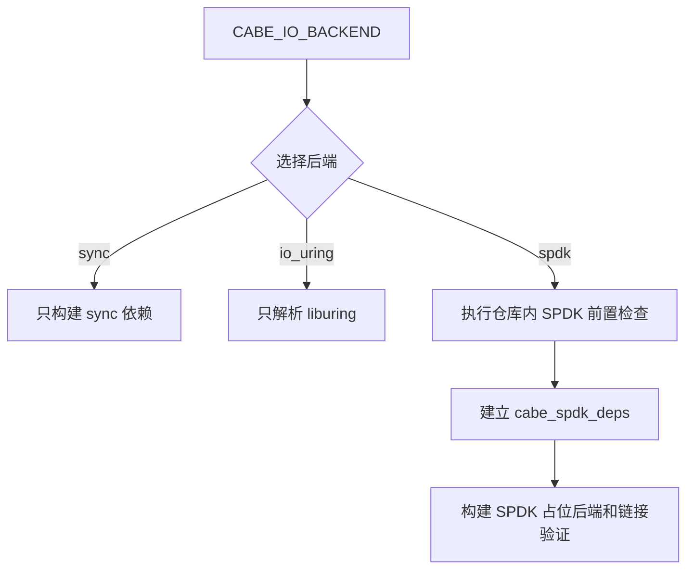
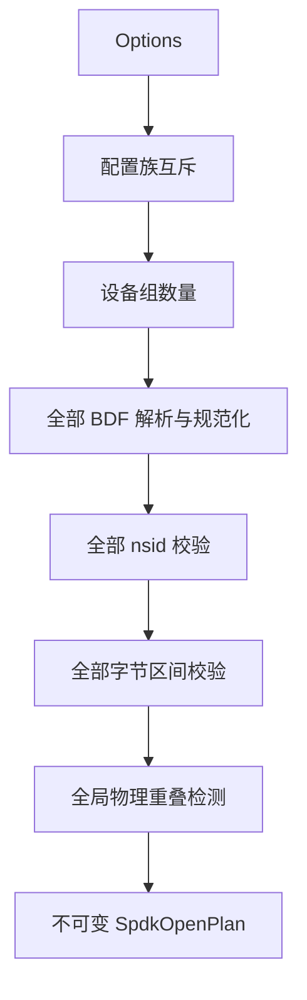

# Cabe P9-M1 设计：SPDK 构建接入与配置模型

> 本里程碑在 P9M0 已完成的“仓库内固定版本 SPDK 子模块 + 环境脚本”基础上，
> 把 SPDK 正式接入 Cabe 构建系统，并建立后续所有 SPDK 里程碑共同使用的类型化设备配置、
> 纯配置校验、错误码段和测试安全门禁。
>
> **本文为 P9M1 详细设计与实现基线**，汇总 P9M1-D1 ~ P9M1-D18 的全部裁决及落地结果。
> sanitizer 与覆盖率如何匹配 SPDK 构建变体仍作为 P9M1-D19 待决，见 §16。

---

## 0. 元信息

| 项 | 值 |
|---|---|
| 阶段 / 里程碑 | P9 / M1 |
| 状态 | ✅ D1-D18 已实现并通过普通构建验证；D19 待决 |
| 上游依赖 | P1 ~ P8 已完成；P9M0 已完成；P9 总体计划见 `doc/P9/README.md` |
| 下游依赖本里程碑 | P9M2 定向探测；P9M3 qpair / DMA / 读写验证；P9M4 `SpdkNvmeDevice`；P9M6 以后各 SPDK 设备路径 |
| 退出判定 | 见 §14；D19 不计入普通无 sanitizer 构建的 M1 退出条件，但必须在 P9 测试收敛前解决 |

---

## 1. 目标与范围

### 1.1 目标

1. **建立唯一 SPDK 构建入口**：`CABE_IO_BACKEND=spdk` 是启用 SPDK 构建的唯一 CMake 开关；脚本侧对应 `--backend=spdk`。
2. **固定仓库内依赖来源**：只使用 `third_party/spdk` 的本地构建产物，不查找系统 SPDK，不接受外部根目录覆盖。
3. **建立静态链接契约**：使用 SPDK 默认静态构建，正确处理 SPDK / DPDK 静态归档和系统动态库的链接顺序。
4. **提供无设备链接证据**：默认构建一个引用真实 SPDK NVMe 符号、但绝不初始化环境或访问设备的链接验证程序。
5. **新增类型化 SPDK 配置**：每个设备组显式配置 data、WAL、snapshot 的 `BDF + namespace id + 可选字节区间`。
6. **建立纯配置校验**：在 `spdk_env_init` 前完成配置族、BDF、namespace id、区间和全局重叠检查。
7. **建立不可变打开计划**：调用方 `Options` 经复制、校验和规范化后生成内部 `SpdkOpenPlan`，不把运行时 SPDK 指针放入公开配置。
8. **新增 SPDK 错误码段**：为 SPDK 配置错误分配稳定 Cabe 错误码，不向上层泄漏 SPDK 原始返回值。
9. **建立测试输入与安全门禁**：用类型化环境变量表达测试设备；未配置时安全跳过，错误配置失败，写入测试还需独立授权。
10. **保持现有后端隔离**：sync / io_uring 构建不要求 SPDK 子模块已初始化或已编译，不链接任何 SPDK / DPDK 库。

### 1.2 交付范围

| 交付物 | 设计职责 |
|---|---|
| `cmake/CabeSpdk.cmake` | SPDK 构建前置检查、pkg-config 解析、静态链接闭包和 `cabe_spdk_deps` target |
| `scripts/setup-spdk.sh` | `build` 成功后生成 Cabe 构建戳，`clean` 同步删除构建戳 |
| 根目录及相关子目录 `CMakeLists.txt` | 接入 `spdk` 后端、链接验证、测试目标条件和后端隔离 |
| `engine/options.h` | 新增公开 SPDK 配置值类型，并把 `spdk_devices` 追加到 `Options` 末尾 |
| `engine/spdk_config.h/.cpp` | BDF 解析、配置校验、namespace 视图冲突检测和不可变 `SpdkOpenPlan` |
| `io/spdk/spdk_io_backend_placeholder.h/.cpp` | M1 构建占位类型；满足 `IoBackend` 编译契约但不访问资源、不提供数据路径 |
| `io/spdk/spdk_link_check.cpp` | 无设备 SPDK 真实符号链接验证程序 |
| `common/error_code.h` | 新增 `-107xxx` SPDK 段和 M1 两个具体错误码 |
| `test/engine/spdk_config_test.cpp` | 配置模型、规范化、区间、冲突、生命周期纯单元测试 |
| `test/common/spdk_test_env.h/.cpp` | 测试环境变量解析和写入授权判定；只服务测试代码 |
| `test/common/spdk_test_env_test.cpp` | 环境变量三态、完整性和授权矩阵测试 |
| `test/CMakeLists.txt` | SPDK 测试条件、标签和默认可见性 |
| `doc/P9/P9M1_build_config_design.md` | 本文档 |
| `doc/P9/README.md` / `README.md` / `ROADMAP.md` | 当前设计阶段、配置模型和后续里程碑证据同步 |

文件名允许在实现时按现有目录习惯做等价微调，但模块边界不得改变：公开配置、纯配置计划、
SPDK 构建依赖、运行时资源和测试环境解析必须相互分离。

### 1.3 明确不做

| 不做项 | 归属 |
|---|---|
| `spdk_env_init` / `spdk_env_fini` 原型 | P9M2 |
| 定向 probe / attach 和 namespace 属性枚举 | P9M2 |
| qpair 创建、completion 轮询、DMA 内存和 1 MiB 读写 | P9M3 |
| controller、namespace、qpair 的正式封装 | P9M4 |
| 超级块 SPDK 设备视图 | P9M5 |
| value/data 可工作 I/O 路径 | P9M6 |
| `ValueBufferPool` 的 SPDK DMA 零拷贝 | P9M7 |
| WAL / snapshot SPDK I/O | P9M9 / P9M11 |
| 完整 Engine SPDK create / recover / Put / Get / Delete | P9M12 |
| 自动编译 SPDK、自动配置大页、自动绑定设备 | 不做；继续由 P9M0 脚本显式管理 |
| 系统 SPDK、`CABE_SPDK_ROOT`、`/home/pk/spdk` 回退 | 不做 |
| sanitizer 匹配构建的最终策略 | P9M1-D19 待决，见 §16 |

P9M1 的 `spdk` 后端只形成构建、链接和配置契约。它不是一个可以成功打开设备的后端。

---

## 2. 决策汇总

| 编号 | 决策 | 结论 |
|---|---|---|
| **P9M1-D1** | 构建入口 | 不增加额外 SPDK 开关；只要显式选择 `CABE_IO_BACKEND=spdk` 或 `--backend=spdk`，就进入 SPDK 构建分支。M1 允许该分支只形成占位后端。 |
| **P9M1-D2** | SPDK 来源与路径 | 只使用 `third_party/spdk`；所有路径从 Cabe 项目源码根目录推导，不写机器绝对路径，不提供外部覆盖变量。 |
| **P9M1-D3** | 链接形态 | 使用 SPDK 默认静态库；whole-archive 只包裹具体 SPDK / DPDK 归档，系统库恢复普通链接；Cabe 可执行文件不全静态。 |
| **P9M1-D4** | 依赖闭包 | 由仓库内 SPDK / DPDK 的 pkg-config 与 SPDK 构建元数据解析依赖闭包，不在 Cabe 中手抄易漂移的完整库清单；封装为独立 CMake 接口 target。 |
| **P9M1-D5** | 配置期前置检查 | 只检查子模块、版本、源码树、构建戳、静态模式、关键 `.pc` / 归档、include / library 路径和陈旧路径；不检查运行时环境，不自动修复。 |
| **P9M1-D6** | 链接证据 | 默认构建并注册无设备链接验证程序；必须引用真实 SPDK NVMe 符号，但不得初始化 SPDK、要求 root、大页或设备。 |
| **P9M1-D7** | 设备配置模型 | 每个角色使用 `BDF + namespace id + 可选字节区间`。data 独立 NVMe 是推荐部署而非硬约束；WAL / snapshot 可用独立 namespace，也可用同 namespace 的非重叠区间。 |
| **P9M1-D8** | 公开配置兼容 | 新增 `spdk_devices`，并追加到 `Options` 最后；不复用 Raw 路径字符串，不把 SPDK 指针或运行时句柄放进公开配置。 |
| **P9M1-D9** | 配置族 | `devices` 与 `spdk_devices` 严格互斥；编译后端决定唯一合法配置族，禁止 Raw / SPDK 混合 Engine。 |
| **P9M1-D10** | BDF 与 namespace id | BDF 只接受完整 `dddd:bb:dd.f`，十六进制大小写均可，内部规范化为小写；`nsid` 必须显式给出且位于 `1..0xFFFFFFFE`，不自动选择，也不把 `0xFFFFFFFF` 全局标记当成具体 namespace。 |
| **P9M1-D11** | 字节区间与冲突 | 区间使用字节半开区间，长度非零、4 KiB 对齐且无加法溢出；同 namespace 相邻区间允许，任意物理重叠拒绝，whole namespace 与其他视图冲突。 |
| **P9M1-D12** | 校验阶段 | 纯配置校验与设备事实校验分层；M1 只实现纯配置阶段。全部设备组通过后续动态校验前必须保持全局写入屏障。 |
| **P9M1-D13** | 打开计划 | 纯配置成功后生成不含 SPDK 类型和指针的不可变 `SpdkOpenPlan`；失败不返回部分计划，也不修改调用方 `Options`。 |
| **P9M1-D14** | M1 占位语义 | 合法 SPDK 配置进入 `Engine::Open` 后明确返回 `kEngineNotImplemented`；不假成功、不丢弃 I/O、不启动 Raw 路径、不获取任何 SPDK 或设备资源。 |
| **P9M1-D15** | 测试设备输入 | 使用带设备组编号和角色的环境变量；解析结果区分缺失、有效、非法三态，解析器支持注入环境读取函数。 |
| **P9M1-D16** | 测试安全门禁 | 只读和写入测试分开判定；写入只接受 `CABE_SPDK_ALLOW_WRITE_TESTS=1`。非法配置必须失败，缺失配置才可跳过。 |
| **P9M1-D17** | 错误码 | 新增 `kSpdkBase=-107000`；M1 只定义 `kSpdkInvalidConfig` 和 `kSpdkNamespaceOverlap`；原始 SPDK 状态只进日志。 |
| **P9M1-D18** | 测试与回归矩阵 | 新增 `spdk-unit`、`spdk-link` 和 `spdk` 标签；SPDK 构建继续运行后端中立测试，不能把 Raw Engine 测试伪装成 SPDK 证据；sync / io_uring 必须保持通过。 |

### 2.1 待决 P9M1-D19

P9M1-D19 讨论 sanitizer 与覆盖率如何和 SPDK / DPDK 构建变体匹配。该问题不改变 D1 ~ D18 的功能设计，
也不阻塞普通无 sanitizer 的 P9M1 实现和验收；具体边界见 §16。

---

## 3. 构建入口与依赖边界

### 3.1 唯一入口

根 CMake 已把 `CABE_IO_BACKEND` 设为必填。P9M1 在合法值集合中正式实现 `spdk` 分支：

```bash
cmake -S . -B build-spdk -G Ninja -DCABE_IO_BACKEND=spdk
```

测试脚本对应：

```bash
./scripts/run-tests.sh --backend=spdk
```

禁止新增以下平行开关：

```text
CABE_ENABLE_SPDK
CABE_BUILD_SPDK
CABE_USE_SPDK
CABE_SPDK_EXPERIMENTAL
```

原因是 I/O 后端已经是编译期互斥选择。再增加布尔开关会产生“后端是 spdk 但开关关闭”或
“后端是 io_uring 但开关开启”等无意义组合。

### 3.2 项目内相对路径

SPDK 根目录固定为：

```text
${PROJECT_SOURCE_DIR}/third_party/spdk
```

这里的“相对路径”是指仓库布局相对 Cabe 源码根目录固定，而不是依赖调用 CMake 时的当前工作目录。
CMake 内部可以把该路径规范化为绝对路径用于比较，但该绝对路径必须由当前源码根目录计算得到，
不得写入 `/home/cabe`、`/home/pk/spdk` 或其他机器路径。

不提供：

- `CABE_SPDK_ROOT`；
- 环境变量覆盖；
- 系统 `/usr` 或 `/usr/local` 回退；
- 自动下载或 FetchContent；
- 在 configure 阶段自动执行 `setup-spdk.sh`。

### 3.3 后端隔离

只有 `CABE_IO_BACKEND=spdk` 时才 include `cmake/CabeSpdk.cmake` 并解析 SPDK。



sync / io_uring 构建在 SPDK 子模块未初始化、未编译甚至目录为空时也必须正常配置和构建。

---

## 4. 静态链接设计

### 4.1 为什么采用静态链接

P9M0 使用 SPDK 默认 `./configure`，默认产出静态归档。P9M1 沿用该形态：

- 不要求安装 SPDK 到系统；
- 不引入 SPDK 运行时动态库搜索路径；
- Cabe 与锁定提交的 SPDK 构建产物保持一致；
- 后续可以明确审计实际进入链接的 SPDK / DPDK 归档。

Cabe 本身不做全静态链接。libc、libstdc++、pthread、dl、rt、numa、uuid、m 等系统库保持正常链接方式。

### 4.2 依赖元数据来源

依赖解析只使用当前仓库内构建结果：

```text
third_party/spdk/build/lib/pkgconfig
third_party/spdk/dpdk/build/lib/pkgconfig
third_party/spdk/mk/config.mk
third_party/spdk/build/include/spdk/config.h
```

至少从 `spdk_nvme` 和 `spdk_env_dpdk` 出发解析 SPDK、DPDK 和必要系统库闭包。
SPDK 构建元数据可以补充 pkg-config 没有直接展开的第三方静态归档。

禁止在 Cabe 中维护一份固定的几十个库名清单作为唯一事实来源。SPDK 的内部库闭包会随版本和配置变化，
手抄清单容易出现“当前机器碰巧能链接、换配置后漏库”的问题。

### 4.3 CMake target 边界

新增：

```cmake
add_library(cabe_spdk_deps INTERFACE)
add_library(cabe::spdk_deps ALIAS cabe_spdk_deps)
```

职责：

- 携带 SPDK SYSTEM include 路径；
- 携带具体静态归档；
- 携带第三方和系统链接闭包；
- 携带必要链接选项；
- 不携带 Cabe 的公开配置类型；
- 不执行任何命令或运行时初始化。

`cabe_io` 的 SPDK 实现私有链接该 target。SPDK 头文件不得通过 Cabe 公开头文件向上层应用扩散。

### 4.4 SYSTEM include

SPDK / DPDK 头文件属于锁定的第三方依赖，应作为 SYSTEM include 处理。Cabe 的 `-Wall -Wextra -Wpedantic`
和 `CABE_WERROR` 继续严格约束 Cabe 自有源码，但不把第三方头文件中的风格告警当成 Cabe 缺陷。

这不等于忽略 Cabe 对 SPDK API 的错误使用：类型错误、缺符号和链接错误仍然必须失败。

### 4.5 whole-archive 边界

SPDK / DPDK 本地归档按以下边界链接：

```text
--whole-archive
  libspdk_*.a
  librte_*.a
--no-whole-archive
  SPDK 第三方归档 / pthread / dl / rt / numa / uuid / m / 其他系统库
```

实际实现不依赖文件名通配符传给链接器，而是先解析出具体归档路径，再只对具体 SPDK / DPDK 归档应用
whole-archive。目的在于保留依赖注册表、构造段或只经间接引用到达的对象，同时避免把系统库强制全量拉入。

### 4.6 无副作用配置期前置检查

前置检查顺序固定为：

1. `third_party/spdk` 已初始化，gitlink 及递归子模块状态不是 `-`、`+` 或 `U`；
2. SPDK commit 是 P9M0 锁定提交，`VERSION` 为 `26.01.0`，源码树不存在 tracked 修改；
3. `setup-spdk.sh build` 生成的 Cabe 构建戳存在，提交、版本和关键配置哈希与当前构建一致；
4. `CONFIG_SHARED=n`，本地构建是预期静态形态；
5. `build/include/spdk/config.h` 存在；
6. `spdk_nvme.pc`、`spdk_env_dpdk.pc`、DPDK `.pc` 及依赖闭包可以从项目内目录解析；
7. 闭包中的每个 `libspdk_*` / `librte_*` 都必须解析为仓库内静态归档，禁止同名系统库回退；
8. `.pc` 中引用的项目内 include / library 路径存在且属于当前 `third_party/spdk`；
9. 不允许解析到系统安装、仓库移动前的陈旧路径，或晚于构建戳又被改写的本地归档。

构建戳位于 `third_party/spdk/build/.cabe-build-stamp`，由 `setup-spdk.sh build` 在完整构建成功后原子写入，
记录锁定提交、版本、`mk/config.mk` 与生成配置头的哈希及编译器信息。旧构建戳在新一轮 build 前删除，
`setup-spdk.sh clean` 也同步删除；因此失败或被中断的构建不能沿用旧戳伪装成完整构建。

失败必须 `FATAL_ERROR`，并按原因提示显式命令，例如：

```text
./scripts/setup-spdk.sh init
./scripts/setup-spdk.sh build --jobs=<N>
```

配置期禁止执行上述命令，也禁止检查或修改：

- 大页内存；
- BDF 和 namespace；
- vfio-pci / uio_pci_generic；
- IOMMU group；
- 设备挂载、holder 或系统盘状态。

### 4.7 无设备链接验证

新增默认构建目标 `cabe_spdk_link_check`。它必须：

- 包含真实 SPDK NVMe 头文件；
- 调用一个不需要运行时初始化的真实 API，例如 transport 类型解析函数；
- 经过 `cabe::spdk_deps` 完成最终链接；
- 作为 CTest 测试注册；
- 在没有大页、没有绑定设备、非 root 条件下可以运行并返回 0；
- 不调用 `spdk_env_init`、probe、attach、qpair、DMA 或任何 namespace I/O。

只写一个包含头文件但不引用符号的程序不能证明静态链接闭包成立，因此不满足要求。

---

## 5. 类型化 SPDK 设备配置

### 5.1 公开类型

在 `engine/options.h` 新增标准 C++ 值类型：

```cpp
struct SpdkNvmeByteRange {
    std::uint64_t offset_bytes = 0;
    std::uint64_t length_bytes = 0;
};

struct SpdkNvmeNamespaceConfig {
    std::string bdf;
    std::uint32_t nsid = 0;
    std::optional<SpdkNvmeByteRange> range;
};

struct SpdkDeviceConfig {
    SpdkNvmeNamespaceConfig data;
    SpdkNvmeNamespaceConfig wal;
    SpdkNvmeNamespaceConfig snapshot;
};
```

`Options` 追加：

```cpp
struct Options {
    std::vector<DeviceConfig> devices;

    // 既有字段保持原顺序。
    // ...

    std::vector<SpdkDeviceConfig> spdk_devices;
};
```

`spdk_devices` 必须是 `Options` 最后一个字段，避免已有位置式聚合初始化把旧参数映射到新字段。

### 5.2 为什么不复用路径字符串

Raw 设备由 Linux 块设备路径标识；SPDK NVMe API 使用 PCIe controller 和 namespace 标识。
把 `0000:13:00.0/2` 伪装成路径会造成：

- 无法用类型区分 BDF、nsid 和可选设备视图；
- 错误只能推迟到字符串解析；
- 难以表达同 namespace 的非重叠区域；
- 容易让 RawDevice 代码误接 SPDK 配置；
- 后续 controller 去重和 namespace 验证缺少稳定结构。

因此 Raw 与 SPDK 使用不同配置族，但保持同一个 `Engine::Open(const Options&)` 入口。

### 5.3 设备组语义

`spdk_devices[i]` 与 Raw 路径 `devices[i]` 一样，表示 Cabe 的第 `i` 个逻辑设备组，包含 data、WAL、snapshot
三种角色。角色映射显式存在，代码不按 namespace id 数值猜测用途。

推荐部署：

- data 使用独立普通 NVMe SSD；
- WAL 可使用 Optane NVMe SSD、低延迟 SLC 类 NVMe SSD或其他满足持久化语义的设备；
- snapshot 可使用普通 NVMe 的独立 namespace 或独立区域。

这些是硬件与部署建议，不是 M1 配置硬约束。M1 只校验配置是否自洽和物理区域是否重叠。

### 5.4 可选字节区间

`range == std::nullopt` 表示使用整个 namespace。

显式区间表示：

```text
[offset_bytes, offset_bytes + length_bytes)
```

使用字节而不是 LBA：

- 公开配置不依赖尚未探测到的 sector size；
- 用户可以按容量规划表达 namespace 内区域；
- P9M2 获取实际 sector size 后再验证是否能转换为合法 LBA；
- 后续 `SpdkNvmeDevice` 负责字节到 LBA 的换算。

M1 只要求 4 KiB 对齐。实际 namespace 边界、sector size、最大传输长度属于设备事实阶段。

---

## 6. 纯配置校验与不可变打开计划

### 6.1 内部值类型

建议内部形态：

```cpp
enum class DeviceConfigFamily : std::uint8_t {
    Raw,
    Spdk,
};

enum class SpdkDeviceRole : std::uint8_t {
    Data,
    Wal,
    Snapshot,
};

struct CanonicalBdf {
    std::uint16_t domain = 0;
    std::uint8_t bus = 0;
    std::uint8_t device = 0;
    std::uint8_t function = 0;
    std::string text;
};

struct ValidatedSpdkNamespacePlan {
    CanonicalBdf bdf;
    std::uint32_t nsid = 0;
    std::optional<SpdkNvmeByteRange> range;
};

struct ValidatedSpdkDevicePlan {
    ValidatedSpdkNamespacePlan data;
    ValidatedSpdkNamespacePlan wal;
    ValidatedSpdkNamespacePlan snapshot;
};
```

`SpdkOpenPlan` 私有持有 `std::vector<ValidatedSpdkDevicePlan>`，只提供 const 观察接口。
它不包含 controller、namespace、qpair、DMA 地址或 SPDK 头文件中的类型。

### 6.2 静态校验顺序

纯配置构建函数按固定顺序执行：

1. 校验活动配置族；
2. 校验设备组数量在 `1 ~ 256`；
3. 按设备组索引、`data -> WAL -> snapshot` 顺序解析每个 BDF；
4. 校验每个 `nsid` 位于 `1..0xFFFFFFFE`，拒绝 `0` 和 NVMe 全局 namespace 标记 `0xFFFFFFFF`；
5. 校验每个显式区间长度、溢出和 4 KiB 对齐；
6. 生成规范化 namespace 视图；
7. 对所有组和所有角色执行全局冲突检查；
8. 成功后一次性返回不可变 `SpdkOpenPlan`。



校验失败不保留部分计划，不修改调用方 `Options`，不启动 SPDK，不产生任何设备副作用。

### 6.3 BDF 规则

只接受完整 PCIe BDF：

```text
dddd:bb:dd.f
```

规则：

- domain 4 位十六进制；
- bus 2 位十六进制；
- device 2 位十六进制且数值不大于 `0x1f`；
- function 1 位十六进制且数值不大于 `7`；
- 不接受首尾空白；
- 不接受省略 domain 的 `13:00.0`；
- 不接受部分解析或多余字符；
- 接受 `A-F`，内部文本规范化为小写。

### 6.4 区间规则

显式区间必须满足：

```text
length_bytes > 0
offset_bytes % 4096 == 0
length_bytes % 4096 == 0
offset_bytes + length_bytes 不发生 uint64_t 溢出
```

M1 不知道实际 namespace 容量，因此不判断区间终点是否超过设备。该判断必须在 P9M2 获取 namespace 容量后执行。

### 6.5 全局区间冲突

将每个角色展开为：

```cpp
struct SpdkNamespaceView {
    CanonicalBdf bdf;
    std::uint32_t nsid = 0;
    std::optional<SpdkNvmeByteRange> range;
    std::size_t group_index = 0;
    SpdkDeviceRole role = SpdkDeviceRole::Data;
};
```

只有 BDF 和 nsid 都相同时才需要比较区间。

| 左视图 | 右视图 | 结果 |
|---|---|---|
| whole | whole | 冲突 |
| whole | range | 冲突 |
| range | whole | 冲突 |
| `[a,b)` | `[b,c)` | 合法，相邻不重叠 |
| `[a,c)` | `[b,d)` 且 `a < b < c` | 冲突 |
| `[a,d)` | `[b,c)` | 冲突 |
| 不同 BDF | 任意 | 不冲突 |
| 同 BDF、不同 nsid | 任意 | 不冲突 |

冲突检测必须跨：

- 同组不同角色；
- 不同组同角色；
- 不同组不同角色。

不能只检查每个设备组内部。

### 6.6 纯配置与设备事实分层

P9M1 只负责不依赖硬件的纯配置事实。P9M2 以后负责：

- BDF 是否真实存在；
- controller 是否能 attach；
- nsid 是否存在且 active；
- namespace 实际容量；
- sector size；
- 区间能否整除 sector size；
- Flush 和易失写缓存能力；
- 最大传输大小。

任何设备事实校验完成前都不得执行写入。后续 Open 流程必须先验证全部设备组，再统一解除写入屏障，
不能“前几个设备已通过就先写，后一个设备再失败”。

---

## 7. M1 占位后端与 Engine 语义

### 7.1 占位后端

`CABE_IO_BACKEND=spdk` 时，编译期分派选择 `SpdkIoBackendPlaceholder`。它只用于证明：

- `IoBackend` 抽象可以容纳未来 SPDK 后端；
- Engine 及其依赖能够在 SPDK 构建中完成编译；
- SPDK 构建依赖没有污染公开 API。

占位后端满足现有 `IoBackend` concept 所需签名，但：

- `Open` 不打开任何资源；
- 读写、Flush、注册缓冲区等能力返回明确未实现；
- `IsOpen` 始终为 false；
- `Close` 对空资源安全；
- 不包含 RawDevice 或 io_uring 回退。

### 7.2 `Engine::Open` 分支

SPDK 构建下：

1. 若 Engine 已打开，沿用 `kEngineAlreadyOpen`；
2. 校验 Raw / SPDK 配置族；
3. 构建纯配置 `SpdkOpenPlan`；
4. 配置失败返回稳定 SPDK 错误码；
5. 配置成功后返回 `kEngineNotImplemented`；
6. 不写入 `options_`，不创建 reactor，不建立缓冲池，不打开任何设备；
7. Engine 保持关闭状态。

Raw 构建下：

- 继续使用 `Options::devices`；
- `spdk_devices` 非空时拒绝；
- 既有空配置错误语义和 Raw 行为保持不变；
- 不执行 SPDK CMake 检查，也不链接 SPDK。

### 7.3 禁止假成功

以下做法全部禁止：

- 合法 SPDK 配置返回成功但不执行 I/O；
- SPDK 配置失败后改读 `Options::devices`；
- 用 sync 路径让现有 Engine 测试在 `backend=spdk` 下假通过；
- 返回成功但把 I/O 静默丢弃；
- 为了让测试通过而把 SPDK 配置转换成临时文件或 loop 设备。

M1 的“占位”只表示编译和链接契约已成立，不表示任何数据路径已经可用。

---

## 8. 错误码与诊断

### 8.1 新段位

`common/error_code.h` 追加：

```cpp
inline constexpr int kSpdkBase = -107000;

static_assert(kSnapshotBase - kSegmentSize == kSpdkBase);

inline constexpr int kSpdkInvalidConfig =
    InSeg(kSpdkBase, 0);              // -107000

inline constexpr int kSpdkNamespaceOverlap =
    InSeg(kSpdkBase, 1);              // -107001
```

并增加段内边界断言。既有 `-100xxx ~ -106xxx` 数值完全不变。

### 8.2 映射规则

| 错误 | Cabe 错误码 |
|---|---|
| 配置族、组数、BDF、nsid、区间、对齐非法 | `kSpdkInvalidConfig` |
| 两个 namespace 设备视图物理重叠 | `kSpdkNamespaceOverlap` |
| M1 合法配置但真实 Engine 未实现 | `kEngineNotImplemented` |
| 子模块、`.pc`、静态归档缺失 | CMake `FATAL_ERROR`，不进入运行时错误码 |
| 测试环境变量非法 | 测试失败及诊断文本，不进入生产 `Status` |

### 8.3 日志

M1 配置错误日志至少包含：

- 设备组索引；
- data / WAL / snapshot 角色；
- 原始 BDF 或规范化 BDF；
- nsid；
- whole / range；
- offset 和 length；
- 冲突双方身份。

后续 probe、controller、namespace、qpair、DMA、提交、completion 和超时错误在实际调用点出现时继续在
`-107xxx` 段内追加。不得在 M1 预定义一批无调用点的猜测错误码。

SPDK 原始负 errno、completion SCT/SC 或 transport 状态不得直接装入公开 `Status`。后续统一转换为稳定
Cabe 错误码，同时在日志记录原始状态。

---

## 9. 测试环境配置

### 9.1 环境变量模型

测试配置使用：

```text
CABE_TEST_SPDK_GROUP_COUNT
CABE_TEST_SPDK_G<编号>_<角色>_<字段>
```

单组示例：

```bash
export CABE_TEST_SPDK_GROUP_COUNT=1
export CABE_TEST_SPDK_G0_DATA_BDF=0000:13:00.0
export CABE_TEST_SPDK_G0_DATA_NSID=2
export CABE_TEST_SPDK_G0_WAL_BDF=0000:13:00.0
export CABE_TEST_SPDK_G0_WAL_NSID=3
export CABE_TEST_SPDK_G0_SNAPSHOT_BDF=0000:13:00.0
export CABE_TEST_SPDK_G0_SNAPSHOT_NSID=1
```

显式区间成对出现：

```bash
export CABE_TEST_SPDK_G0_WAL_OFFSET_BYTES=0
export CABE_TEST_SPDK_G0_WAL_LENGTH_BYTES=1073741824
```

规则：

- `GROUP_COUNT` 是十进制 `1 ~ 256`；
- 组号从 `G0` 开始连续；
- 每组的 data / WAL / snapshot BDF 和 nsid 必须完整；
- nsid、offset、length 只接受无空白的十进制整数；
- offset / length 同时存在或同时缺失；
- 不接受 `1G`、`1GiB`、十六进制和宽松部分解析；
- 解析后复用生产侧纯配置校验，不复制一套宽松规则。

### 9.2 三态结果

```cpp
enum class SpdkTestConfigState {
    Absent,
    Valid,
    Invalid,
};
```

| 状态 | 含义 | 测试行为 |
|---|---|---|
| `Absent` | `GROUP_COUNT` 未设置 | 真实硬件测试可安全跳过 |
| `Valid` | 全部字段完整且通过正式校验 | 生成 `std::vector<SpdkDeviceConfig>` |
| `Invalid` | 已开始配置但字段缺失、格式非法或冲突 | 明确失败，不得伪装成缺环境 |

解析器接受可注入的环境查找回调；单元测试使用内存 map，不通过 `setenv/unsetenv` 修改进程全局环境，
避免并行测试间的数据竞争和状态污染。

生产代码和 `Engine::Open()` 不读取任何 `CABE_TEST_*` 变量。

### 9.3 写入授权

写入授权使用独立变量：

```bash
export CABE_SPDK_ALLOW_WRITE_TESTS=1
```

仅接受精确值 `1`。未设置表示禁用；设置为其他非空值表示错误，不解释 `true/yes/on`。

| 设备配置 | 写入授权 | 只读测试 | 写入测试 |
|---|---|---|---|
| 未配置 | 未设置 | 跳过 | 跳过 |
| 有效 | 未设置 | 运行 | 跳过 |
| 有效 | `1` | 运行 | 运行 |
| 非法 | 任意 | 失败 | 失败 |
| 未配置 | `1` | 跳过 | 失败 |
| 有效 | 非空且不是 `1` | 失败 | 失败 |

写入门禁覆盖 NVMe write、write zeroes、deallocate、超级块初始化、WAL、snapshot 和任何
`Engine::Open(create=true)` 流程。format、sanitize 和 namespace 管理命令不属于 Cabe 自动测试范围，
即使授权也禁止自动执行。

条件检查必须发生在 `spdk_env_init`、probe、qpair、DMA 和 namespace 命令之前。

P9M1 本身没有硬件测试，但先建立统一门禁，避免后续每个里程碑再发明一套不一致规则。

---

## 10. 测试目标与 CTest

### 10.1 构建条件

不增加 `CABE_BUILD_SPDK_TESTS`。仅当以下两个条件同时成立时构建 SPDK 专用测试：

```text
CABE_BUILD_TESTS=ON
CABE_IO_BACKEND=spdk
```

硬件环境变量只在测试运行时解析，不参与 CMake 测试目标是否存在的判断。

### 10.2 标签

| 标签 | 内容 | M1 状态 |
|---|---|---|
| `spdk-unit` | 配置、BDF、区间、冲突、测试环境解析 | M1 实现并运行 |
| `spdk-link` | 无设备真实 SPDK 链接验证 | M1 实现并运行 |
| `spdk-readonly` | probe / namespace 属性 | P9M2 开始加入 |
| `spdk-write` | qpair / DMA / 写入 / Engine | P9M3 开始加入 |

所有上述测试同时带 `spdk` 总标签。GoogleTest 使用 `GTEST_SKIP()` 报告环境缺失；
`gtest_discover_tests()` 负责把跳过状态映射到 CTest。

### 10.3 现有测试在 SPDK 构建中的边界

P9M1 的 SPDK Engine 尚不可用，因此测试分类为：

| 现有测试 | SPDK 构建行为 |
|---|---|
| CRC、hash、结构、错误码等后端无关单元测试 | 继续运行 |
| P9M1 配置、环境变量和链接测试 | 新增并运行 |
| 独立 RawDevice / sync 组件测试 | 可按自身目标保留，但不得宣称验证 SPDK |
| 依赖 `Options::devices` 且要求 Engine 成功 Open 的测试 | 不作为 SPDK Engine 测试注册 |
| 完整 Engine SPDK 测试 | P9M12 首次加入 |

不能通过给现有 Raw Engine 测试统一加 `GTEST_SKIP()`，制造“SPDK 测试已经存在”的假象。

---

## 11. 测试计划

### 11.1 构建与链接测试

1. sync 构建不触发 SPDK 检查和链接；
2. io_uring 构建不触发 SPDK 检查和链接；
3. SPDK 子模块未初始化时，SPDK 配置清晰失败并提示 `setup-spdk.sh init`；
4. SPDK 未编译时，SPDK 配置清晰失败并提示 `setup-spdk.sh build`；
5. `.pc` 指向旧仓库路径、系统路径或不存在路径时拒绝配置；
6. 构建戳缺失、配置哈希不匹配或闭包归档晚于构建戳时拒绝配置；
7. SPDK 构建成功时 `cabe_spdk_link_check` 属于默认构建；
8. 链接验证运行时不要求设备、大页或 root；
9. GCC 15+ 和 Clang 20+ 均能链接同一标准 SPDK 静态构建；
10. SPDK / DPDK 头文件不向公开 Cabe target 扩散；
11. 最终可执行文件不动态依赖 `libspdk_*.so` 或 `librte_*.so`。

### 11.2 配置单元测试

至少覆盖：

- 三角色、单组和多组合法配置；
- `devices` / `spdk_devices` 两者为空、两者非空和后端错配；
- BDF 完整格式、大小写规范化、简写、非法 device / function、首尾空白；
- `nsid == 0` 或 `nsid == 0xFFFFFFFF`；
- 整个 namespace；
- 显式区间长度为零、加法溢出和 4 KiB 不对齐；
- 同 namespace 相邻区间合法；
- 完全重叠、部分重叠、包含、whole + range、跨组和跨角色重叠；
- 不同 BDF、不同 nsid 不冲突；
- 调用方配置未被规范化过程修改；
- 失败不返回部分计划；
- 设备组上限 256 和越界 257；
- 合法 SPDK 配置得到 `kEngineNotImplemented` 且 Engine 保持关闭；
- Raw 或混合配置在 SPDK 构建中被拒绝。

### 11.3 错误码测试

扩展现有 `test_error_code`：

```text
kSpdkBase == -107000
kSpdkInvalidConfig == -107000
kSpdkNamespaceOverlap == -107001
kSnapshotBase - kSegmentSize == kSpdkBase
两个具体码位于 SPDK 段内
既有段值不变
```

### 11.4 测试环境解析

至少覆盖：

- `GROUP_COUNT` 缺失 -> `Absent`；
- 单组、多组完整配置 -> `Valid`；
- count 为 0、负数、溢出、尾随字符；
- 组号缺口；
- 任一角色 BDF / nsid 缺失；
- offset / length 只提供一个；
- 带单位、十六进制、空白、负数和部分解析；
- 配置完整但正式校验失败 -> `Invalid`；
- 授权未设置、精确 `1` 和非法非空值；
- 授权存在但设备配置缺失时写入测试失败。

### 11.5 M1 不运行的测试

P9M1 测试不得调用：

- `spdk_env_init`；
- controller probe / attach；
- namespace 枚举；
- qpair / DMA；
- read / write / Flush；
- 任何真实 NVMe 设备。

因此 P9M1 普通测试不需要执行 `spdk-device.sh bind`，也不需要设置 `CABE_TEST_SPDK_*`。

---

## 12. 实施顺序

按以下顺序实现，每一步都保持 sync / io_uring 可构建：

1. 更新 `Options` 标准值类型和 SPDK 错误码段；
2. 实现纯 BDF 解析、区间检查和 `SpdkOpenPlan`，先完成无 SPDK 运行时依赖单元测试；
3. 实现测试环境变量解析及其纯单元测试；
4. 新增 `cmake/CabeSpdk.cmake` 和配置期前置检查；
5. 建立 `cabe_spdk_deps` 静态链接闭包；
6. 新增 `cabe_spdk_link_check`，验证默认构建和 CTest；
7. 新增 SPDK 占位后端和 `backend_config.h` 分派；
8. 在 `Engine::Open` 接入配置族检查、纯计划构建和明确未实现返回；
9. 调整测试目标分类，完成 sync / io_uring / spdk 普通构建矩阵；
10. 同步 P9 总体文档、README 和 ROADMAP；
11. 解决 D19 后补充相应脚本矩阵，或明确推迟到 P9M14。

实现过程中不得用临时外部 SPDK 路径让构建先过，再把仓库内接入留到以后。

---

## 13. 文档与后续里程碑修正

### 13.1 覆盖总体文档的早期表述

P9M1 最新设计覆盖 P9 总体文档中的四处早期表述：

1. `BDF + namespace id` 扩展为 `BDF + namespace id + 可选字节区间`；
2. “重复 namespace 被拒绝”改为“重叠 namespace 设备视图被拒绝”；
3. `spdk_devices` 从 `Options` 第二个字段移到末尾；
4. 禁止临时 Raw / SPDK 混合 Engine，因此组件级证据与完整 Engine 证据必须分开。

### 13.2 后续证据边界

| 里程碑 | P9M1 后的证据边界 |
|---|---|
| P9M2 | 在 M1 配置和测试门禁上增加运行时初始化、定向 probe 和只读 namespace 事实校验 |
| P9M3 | 增加 qpair、DMA、同步 completion 和受保护写入验证，不接 Engine 主路径 |
| P9M5 | 三类 SPDK 设备视图的超级块组件验证 |
| P9M6 | `SpdkIoBackend` value/data 直接组件读写，不宣称完整 Engine `Put/Get/Delete` |
| P9M7 | `ValueBuffer` / DMA 零拷贝组件验证 |
| P9M9 | WAL SPDK 独立组件验证 |
| P9M11 | snapshot SPDK 独立组件验证 |
| P9M12 | 首次组合 value、WAL、snapshot、superblock，完成 Engine create / recover 端到端 |

---

## 14. 退出条件

### 14.1 构建

- `CABE_IO_BACKEND=spdk` 完成配置、编译和静态链接；
- `cabe_spdk_link_check` 默认构建并可在无设备条件下运行；
- 缺少子模块、构建产物或遇到陈旧 `.pc` 路径时 CMake 清晰失败；
- 构建戳缺失或不匹配、源码树存在 tracked 修改、仓库内归档被构建后改写时 CMake 清晰失败；
- sync / io_uring 构建不依赖 SPDK 子模块、头文件或库；
- 不存在系统 SPDK 或外部路径回退；
- GCC 15+ 与 Clang 20+ 普通构建通过。

### 14.2 配置

- `Options` 可以表达多 SPDK 设备组和每角色可选字节区间；
- BDF 被严格解析和规范化，nsid 不自动选择；
- Raw / SPDK 配置族严格互斥；
- 全局重叠 namespace 设备视图在硬件访问前被拒绝；
- 合法输入生成不含 SPDK 指针的不可变 `SpdkOpenPlan`；
- M1 SPDK Engine 合法配置明确返回 `kEngineNotImplemented`，无假成功或回退。

### 14.3 错误与测试

- `-107xxx` SPDK 段和两个 M1 错误码落地；
- 测试配置解析区分缺失、有效和错误；
- 写入许可与设备配置独立；
- `spdk-unit` 和 `spdk-link` 测试可见并通过；
- M1 普通测试不初始化 SPDK、不要求设备、不写盘；
- 现有 sync / io_uring 回归保持通过。

### 14.4 文档

- 本文覆盖 D1 ~ D18；
- `doc/P9/README.md` 中早期配置、冲突和里程碑证据按最新设计修正；
- README 与 ROADMAP 明确 P9M1 的 D1-D18 已实现，下一步进入 P9M2；
- D19 的状态被明确记录，不被伪装成已裁决。

---

## 15. 风险与缓解

| 风险 | 后果 | 缓解 |
|---|---|---|
| SPDK 子模块存在但未递归初始化 | pkg-config 或静态归档缺失，错误晦涩 | 配置期先检查 gitlink 和递归子模块状态，给出 `setup-spdk.sh init` |
| 仓库移动后 `.pc` 保留旧绝对路径 | 错误链接旧目录，形成不可复现构建 | 校验所有项目内 include / library 路径属于当前 `third_party/spdk` |
| 旧提交或中断构建的归档残留 | HEAD 正确但链接到来源不明的陈旧产物 | `setup-spdk.sh build` 成功后写构建戳；CMake 校验提交、配置哈希和归档时间 |
| 系统 SPDK 被 pkg-config 意外选中 | 锁定版本和本地修改失效 | 同时限定 `PKG_CONFIG_PATH` 与 `PKG_CONFIG_LIBDIR`，拒绝外部路径 |
| 静态依赖被链接器裁掉 | 运行时缺注册对象或未定义符号 | 具体本地 SPDK / DPDK 归档 whole-archive + 默认链接验证程序 |
| whole-archive 包裹系统库 | 可执行文件膨胀或出现重复符号 | 只包裹解析出的具体 SPDK / DPDK 归档，系统库普通链接 |
| SPDK 头文件继承 Cabe 的全量 Werror | 第三方告警阻塞构建 | 第三方 include 标记 SYSTEM，Cabe 自有代码继续严格告警 |
| `spdk_devices` 插入旧字段中间 | 位置式聚合初始化静默错位 | 新字段只追加到 `Options` 末尾，并补兼容测试 |
| BDF 使用宽松解析 | 错误设备标识直到运行时才暴露 | 固定完整格式、拒绝空白与尾随字符、规范化后比较 |
| 只检查组内 namespace 重复 | 跨组物理区域被重复使用，可能互相覆盖 | 展开所有组和角色，执行全局物理区间冲突检测 |
| 把重复 namespace 一律拒绝 | 无法表达 WAL / snapshot 共享 namespace 的合理部署 | 允许同 namespace 非重叠显式区间，whole namespace 保持独占 |
| M1 占位后端假成功 | 上层误以为数据已经持久化 | 合法配置统一返回 `kEngineNotImplemented`，Engine 保持关闭 |
| 缺失测试配置与错误测试配置都跳过 | 配置错误被 CI 隐藏 | 三态解析；只有 `Absent` 可跳过，`Invalid` 必须失败 |
| 写入授权使用宽松布尔解析 | 拼写错误仍可能触发破坏性测试 | 只接受精确 `CABE_SPDK_ALLOW_WRITE_TESTS=1` |
| sanitizer 只覆盖 Cabe 或与 SPDK 变体不匹配 | 测试结论失真 | D19 单独裁决；未裁决前不把 sanitizer 组合作为 M1 验收结论 |

---

## 16. 待决 P9M1-D19

### 16.1 问题

Cabe 的测试脚本支持 ASAN、TSAN 和 UBSAN，但 P9M0 构建出的 SPDK / DPDK 是普通默认构建。直接把
Cabe 可执行文件加 sanitizer 后链接普通 SPDK 归档，可能出现三类问题：

1. 只能检测 Cabe 代码，无法覆盖未插桩 SPDK / DPDK 内部；
2. DPDK 的内存模型、汇编和线程行为可能产生不适用或误导性报告；
3. sanitizer 运行时和静态链接顺序可能与普通构建不同。

覆盖率也需要明确是否只统计 Cabe 并排除 `third_party/spdk`。

### 16.2 待裁决选项

后续应在以下方向中选择并形成单独结论：

- sanitizer 只承诺 Cabe 自有代码，SPDK 保持普通构建；
- 为每种 sanitizer 单独构建匹配的 SPDK 变体；
- P9M1 不运行 SPDK sanitizer 组合，统一在 P9M14 处理；
- 覆盖率只统计 Cabe，自始至终排除 `third_party/spdk`。

### 16.3 当前边界

在 D19 被确认前：

- 本文只把普通无 sanitizer 的 SPDK 构建列为 P9M1 必须退出条件；
- 不宣称 SPDK / DPDK 已被 sanitizer 或覆盖率插桩；
- 不允许测试脚本静默运行一个语义不清的组合并将其标记为完整通过；
- `run-tests.sh` 对 `--backend=spdk` 与 ASAN、TSAN、UBSAN 的组合直接返回参数错误；
- D19 最迟在 P9M14 测试收敛前解决。

---

## 17. P9M2 入口

P9M1 完成后，P9M2 可以直接复用：

- 仓库内 SPDK 构建依赖 target；
- 类型化 `spdk_devices`；
- BDF 规范化结果；
- 不可变 `SpdkOpenPlan`；
- 测试环境变量三态解析；
- `spdk-readonly` / `spdk-write` 标签体系；
- 严格写入授权门禁；
- `-107xxx` 错误码段。

P9M2 只在这些纯构建和纯配置基础上新增运行时初始化、定向 probe 和只读 namespace 事实校验，
不得重新设计另一套设备配置或测试授权协议。
